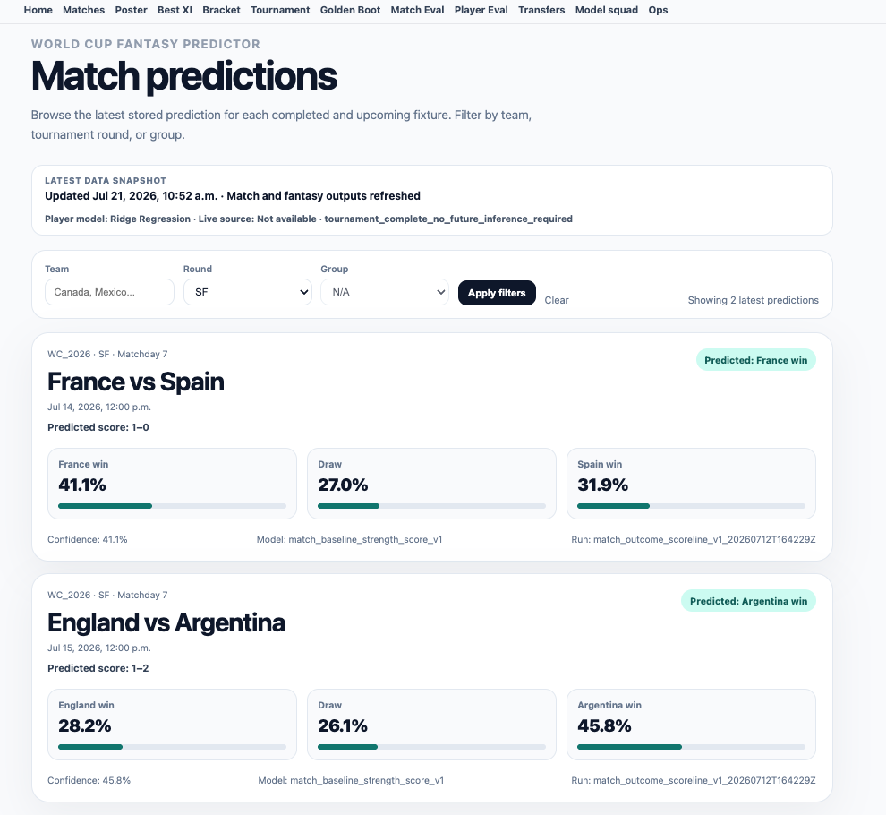
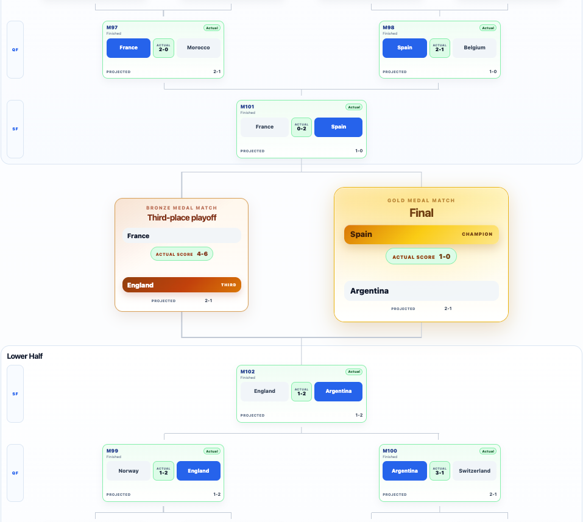
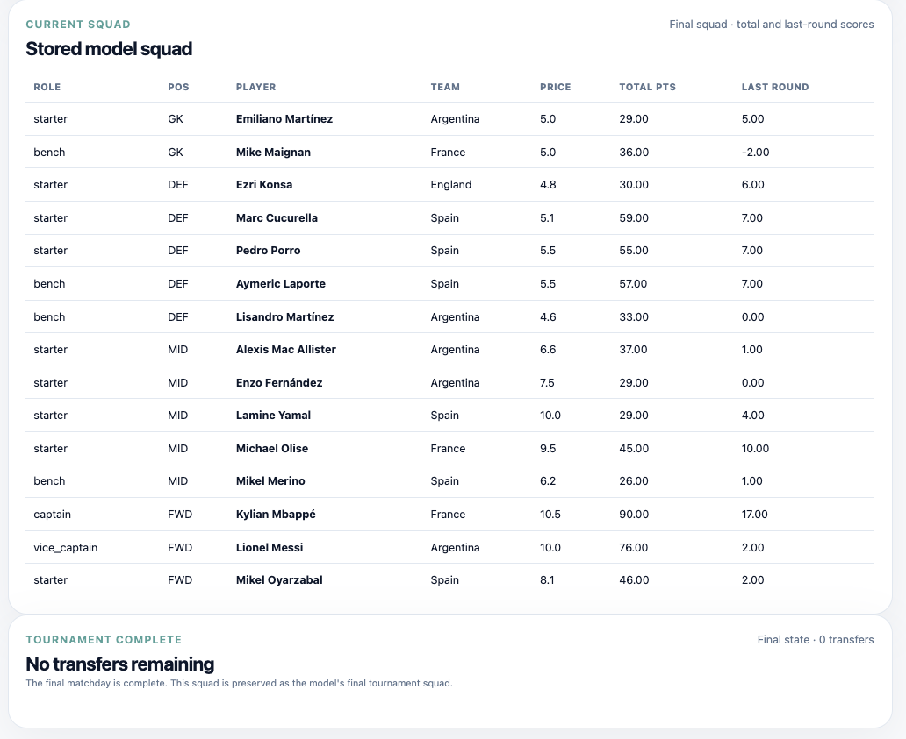
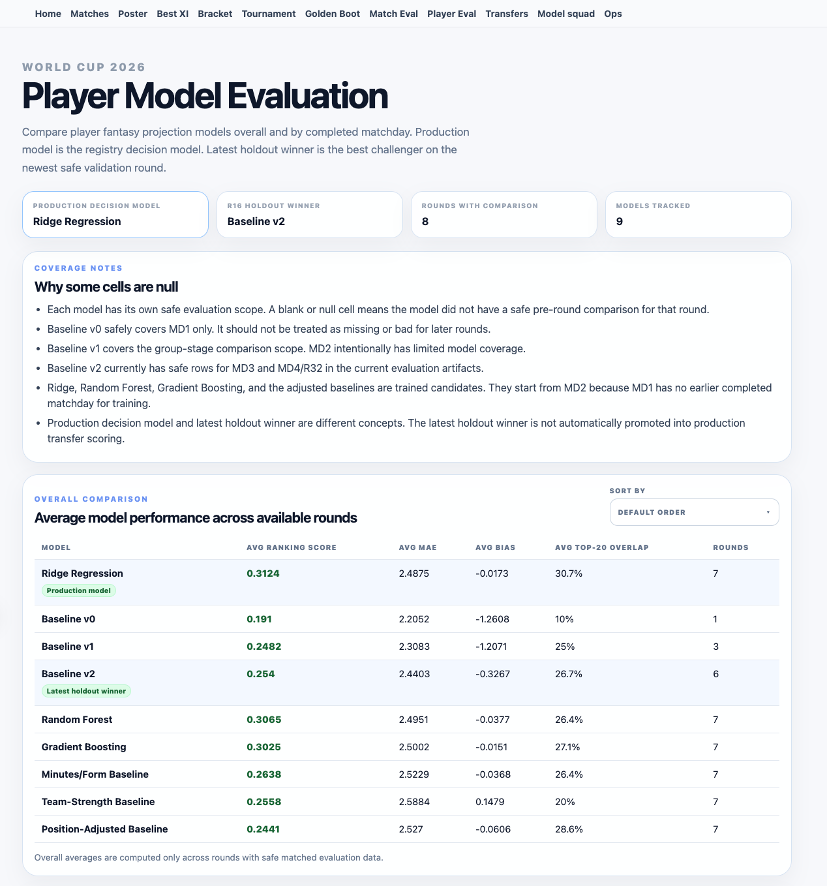
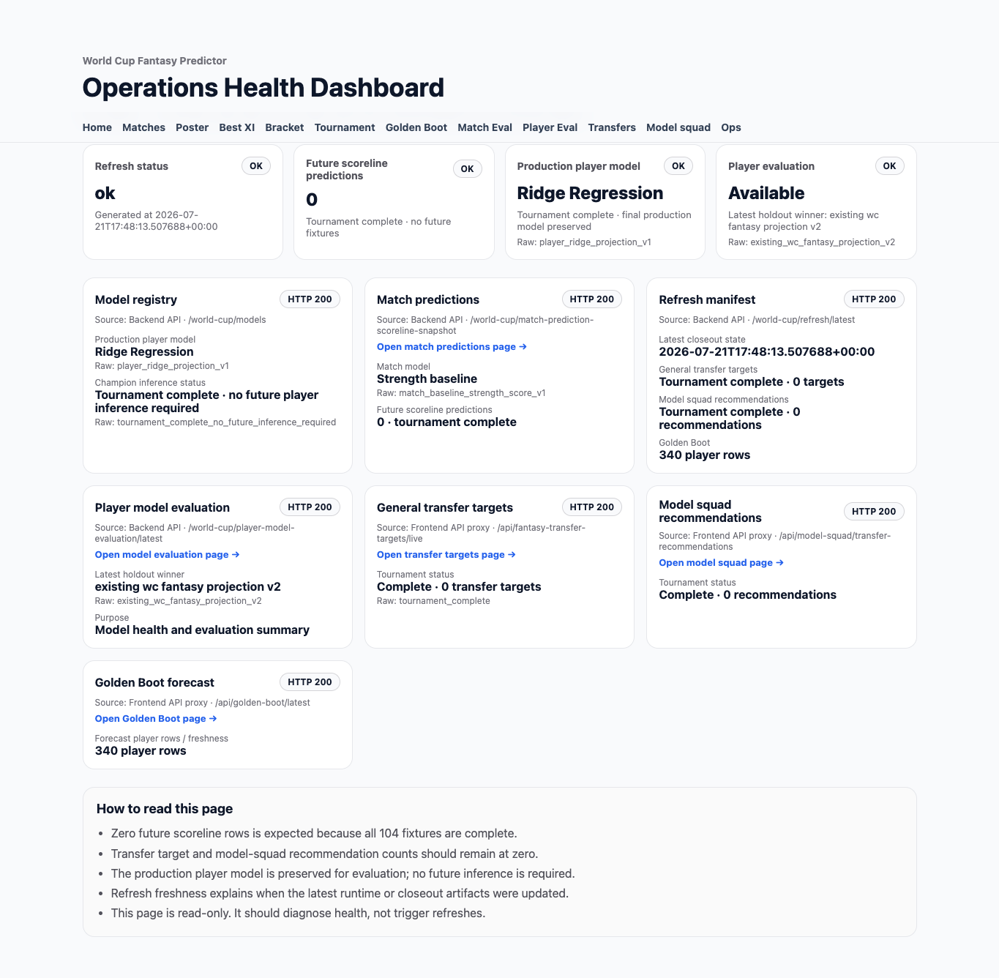
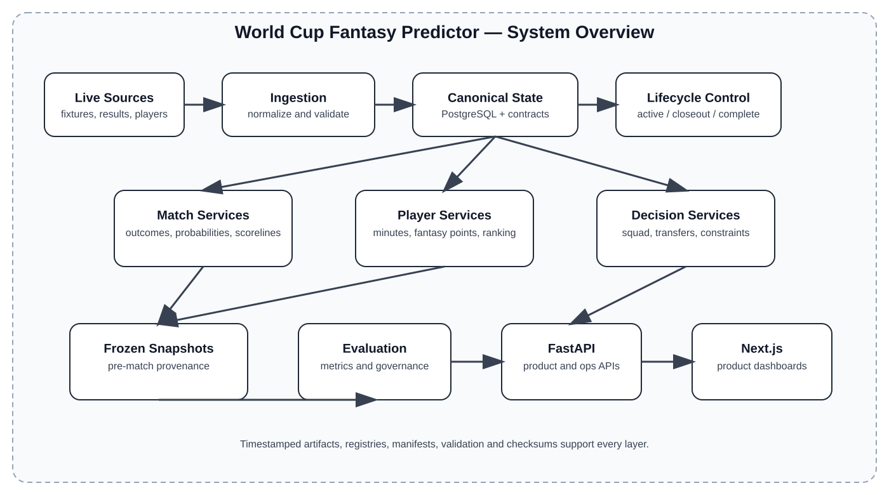

# World Cup Fantasy Predictor — Engineering Case Study

> A full-stack ML system for live World Cup data, match and player forecasts, fantasy transfer decisions, and leakage-safe model evaluation.

> **Independent and unofficial.** This project is not affiliated with, sponsored by, or endorsed by FIFA or any tournament organizer.

## Product overview

The World Cup Fantasy Predictor was operated across a complete international football tournament. It combined live data ingestion, canonical state management, match and player forecasting, fantasy decision workflows, model evaluation, and operational monitoring in one full-stack system.

### Headline scope

| System evidence | Final result |
|---|---:|
| Tournament fixtures processed | **104 / 104** |
| Valid pre-match outcome predictions evaluated | **104 / 104** |
| Player-round observations per production model | **1,775** |
| Product and operations surfaces | **9** |
| Operating modes | **3** |
| Checksum-verified closeout artifacts | **92** |

The project’s main achievement was not one prediction model. It was the engineering lifecycle that kept data, predictions, decisions, historical evidence, APIs, and frontend state consistent from the group stage through tournament closeout.

## Product screenshots

<table>
  <tr>
    <td width="50%" valign="top">
      
      <br><strong>Match predictions.</strong> Stored semifinal forecasts with outcome probabilities, predicted scorelines, model identity, and run provenance.
    </td>
    <td width="50%" valign="top">
      
      <br><strong>Knockout bracket.</strong> Actual and projected tournament paths converge into the final, third-place match, and champion state.
    </td>
  </tr>
  <tr>
    <td width="50%" valign="top">
      
      <br><strong>Model squad.</strong> The persisted 15-player squad remains available after the final transfer window closes.
    </td>
    <td width="50%" valign="top">
      
      <br><strong>Player evaluation.</strong> Production, holdout, and challenger models are compared only across rounds with safe pre-round evidence.
    </td>
  </tr>
  <tr>
    <td colspan="2" valign="top">
      
      <br><strong>Operations health.</strong> The terminal dashboard confirms preserved models and artifacts, zero future predictions, and zero actionable recommendations.
    </td>
  </tr>
</table>

Additional reviewed product views are documented under [`assets/screenshots/`](assets/screenshots/) and the detailed case-study documents below.

## What the system does

The system:

- ingested live and official tournament data;
- normalized source-specific records into canonical match and player state;
- generated match outcomes, probabilities, and knockout scorelines;
- generated player fantasy projections and rankings;
- supported squad, transfer, Team of the Round, and Golden Boot workflows;
- archived immutable pre-round prediction snapshots;
- evaluated completed rounds without post-result leakage;
- exposed prediction, evaluation, fantasy, and operational state through FastAPI and Next.js;
- entered an explicit terminal state after the final match.

## Architecture overview



```text
Live and official sources
  -> ingestion and normalization
  -> canonical PostgreSQL state
  -> match and player prediction services
  -> post-model safety contracts
  -> immutable pre-round snapshots
  -> fantasy decision workflows
  -> FastAPI APIs
  -> Next.js product surfaces
  -> completed-round evaluation
  -> operations and lifecycle health
```

The architecture deliberately separates:

- raw source records from canonical state;
- mutable current outputs from immutable historical evidence;
- model predictions from valid fantasy decisions;
- active tournament behavior from terminal behavior.

See [System Architecture](docs/architecture.md) and [Data Pipeline and Canonical State](docs/data-pipeline.md).

## Live tournament workflow

The system supported three lifecycle modes.

### Tournament active

```text
sync current results and player data
-> refresh current and future predictions
-> generate fantasy recommendations
-> update product surfaces
-> validate APIs and operations health
```

### Round closeout

```text
sync completed results
-> rebuild canonical actuals
-> evaluate frozen pre-round snapshots
-> rebuild cumulative dashboards
-> generate the next round
-> archive and validate the next snapshot
-> refresh fantasy decisions
```

### Tournament complete

```text
sync final actuals
-> evaluate frozen final snapshots
-> preserve accepted product state
-> generate zero future predictions
-> generate zero actionable transfers
-> verify the final artifact inventory
```

A final state with zero future fixtures, predictions, and recommendations was treated as a valid lifecycle outcome rather than a pipeline failure.

See [Live Operations and Tournament Lifecycle](docs/live-operations.md).

## Match-prediction summary

Historical match evaluation used verified pre-kickoff evidence. Predictions regenerated after results were known were not accepted.

| Metric | Final result |
|---|---:|
| Overall outcome accuracy | **71 / 104 (68.3%)** |
| Group-stage outcome accuracy | **45 / 72 (62.5%)** |
| Knockout outcome accuracy | **26 / 32 (81.3%)** |
| Knockout exact scores | **6 / 32 (18.8%)** |
| Total-goals MAE | **1.34** |
| Multiclass Brier score | **0.488** |
| Multiclass log loss | **0.846** |

A simple descriptive baseline achieved 49.0% outcome accuracy. The frozen production sequence improved on it by 19.2 percentage points.

The result shows useful predictive signal, not state-of-the-art football forecasting.

See [Match-Prediction Evaluation](docs/match-prediction-evaluation.md) and the [Final Match Summary](reports/final-match-summary.md).

## Player-prediction summary

The primary rules-versus-Ridge comparison covered six tournament round groupings and 1,775 leakage-safe player-round observations per model.

| Model | MAE | RMSE | Within 1 | Within 2 | Spearman |
|---|---:|---:|---:|---:|---:|
| Rules-based fantasy baseline | 2.463 | 3.429 | 36.2% | 53.7% | 0.207 |
| Ridge decision model | **2.447** | **3.280** | 28.0% | **55.2%** | **0.281** |

Across the six common rounds:

| Model | Top-20 recall | Avg actual points in model Top 20 | Gain vs full pool |
|---|---:|---:|---:|
| Rules-based fantasy baseline | 25.0% | 4.16 | +1.14 |
| Ridge decision model | **29.2%** | **4.78** | **+1.76** |

Ridge was retained as the fantasy-decision model because it improved ranking quality and reduced large-error exposure. It was not presented as a high-accuracy exact-point model.

See [Player-Prediction Evaluation](docs/player-prediction-evaluation.md) and the [Final Player Summary](reports/final-player-summary.md).

## Fantasy decision features

The decision layer converted forecasts into valid fantasy actions under domain constraints.

It supported:

- persisted 15-player squad state;
- formation, captain, and vice-captain state;
- player prices, bank, and remaining transfers;
- position and team-limit constraints;
- elimination and next-fixture filters;
- availability and projected-minutes checks;
- general transfer targets;
- squad-specific transfer planning;
- special transfer-window and multi-transfer workflows;
- actuals-based Team of the Round;
- Golden Boot projections.

Prediction and recommendation were separate responsibilities. A high predicted score did not automatically become a valid transfer.

See [Fantasy Decision System](docs/fantasy-decision-system.md).

## Engineering challenges solved

### Leakage-safe historical evaluation

Mutable “latest” files could include information created after a match. The system evaluated completed rounds only from immutable, timestamped pre-match snapshots.

### Canonical state consistency

Fixtures, player actuals, squad state, evaluation outputs, and frontend views had separate failure modes. Explicit source ownership and ordered refresh contracts kept them synchronized.

### Tournament-state transitions

Group-stage, knockout, transfer-window, elimination, final, and terminal behavior could not safely share one implicit workflow. The system used explicit active, closeout, and complete modes.

### Historical provenance recovery

Earlier artifacts did not always carry the final snapshot conventions. Run IDs, timestamps, source paths, coverage, and hashes were recovered and validated without recreating predictions after results.

### Terminal-state handling

After the final match, the correct product state contained:

```text
104 completed fixtures
0 future fixtures
0 future predictions
0 actionable transfers
```

### Fantasy scoring realism

Post-model contracts prevented known failure patterns such as high forecasts for eliminated players, no-next-fixture players, or players with unsupported low-minute assumptions.

## Technology stack

| Layer | Technology |
|---|---|
| Backend | FastAPI, Python |
| Frontend | Next.js, React, TypeScript |
| Persistence | PostgreSQL, SQLAlchemy, Alembic |
| Modeling | Rules-based models, Ridge regression, probability and ranking evaluation |
| Operations | Timestamped artifacts, manifests, model registry, validation scripts, SHA-256 checksums |
| Product | Prediction, evaluation, fantasy decision, tournament, and operations surfaces |

## Limitations

- The system was not fully autonomous; some player availability and final squad details required manual confirmation.
- Match-model families evolved during the tournament, limiting some full-tournament calibration comparisons.
- Player fantasy points remained sparse and event-driven.
- Exact player-point forecasting remained noisy.
- Starter-versus-substitute reporting was omitted because the available historical starter field was not reliable enough for final reporting.
- A frozen transfer-versus-hold experiment was not available.
- Raw or scraped data is not redistributed in this repository.

See [Limitations and Future Work](docs/limitations-and-future-work.md).

## Repository scope

This repository is an engineering case study, not a source-code release.

It intentionally excludes:

- application source code;
- environment files and credentials;
- database contents;
- raw API payloads;
- scraped or proprietary datasets;
- internal operational commands;
- local filesystem paths;
- debugging and backup history;
- runtime artifacts and model binaries.

The original production repository remains private.

## Documentation

| Document | Focus |
|---|---|
| [Architecture](docs/architecture.md) | Services, state boundaries, APIs, and product surfaces |
| [Data Pipeline](docs/data-pipeline.md) | Ingestion, normalization, canonical state, and refresh ordering |
| [Match Evaluation](docs/match-prediction-evaluation.md) | Leakage-safe match metrics and benchmarks |
| [Player Evaluation](docs/player-prediction-evaluation.md) | Exact-point, ranking, and realism evaluation |
| [Fantasy Decision System](docs/fantasy-decision-system.md) | Squad, transfer, and domain constraints |
| [Live Operations](docs/live-operations.md) | Active, closeout, and terminal lifecycle |
| [Project Retrospective](docs/project-retrospective.md) | Engineering lessons and redesign priorities |
| [Limitations and Future Work](docs/limitations-and-future-work.md) | Honest scope and future directions |

## Author

**Alex Jiang**

- [GitHub](https://github.com/AlexJiang36)
- Portfolio: to be added
- LinkedIn: to be added

## License and attribution

Repository-authored documentation and diagrams are available under the [MIT License](LICENSE).

Third-party names, trademarks, and referenced tournament data remain the property of their respective owners. This project is independent and unofficial.
