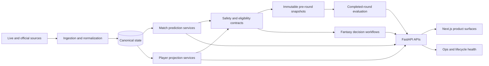

# System Architecture

## Architecture goal

The system was designed to operate prediction and fantasy workflows safely across a changing tournament lifecycle.

The architecture separated five responsibilities:

1. ingestion and normalization;
2. canonical state;
3. prediction and decision services;
4. immutable historical evidence;
5. product and operations surfaces.

## High-level components

### FastAPI backend

The backend coordinated:

- tournament and fixture state;
- match prediction services;
- player projection services;
- model evaluation;
- squad persistence;
- transfer recommendations;
- tournament products;
- operational health.

API routes exposed both user-facing predictions and machine-readable lifecycle status.

### Next.js frontend

The frontend included:

- match predictions;
- knockout bracket;
- match-model evaluation;
- player-model evaluation;
- model squad;
- transfer targets;
- Team of the Round;
- Golden Boot;
- operations dashboard.

The frontend was not only a visualization layer. It made system state, provenance, and terminal behavior visible.

### PostgreSQL and migrations

PostgreSQL stored canonical entities and supported repeatable schema evolution through migrations.

The database layer helped distinguish persistent canonical state from generated artifacts and frontend views.

### Artifact layer

Timestamped artifacts stored:

- match predictions;
- player projections;
- pre-round snapshots;
- evaluation outputs;
- registry metadata;
- refresh manifests;
- closeout inventories and hashes.

Mutable “current” outputs were kept separate from immutable historical evidence.

## Logical flow

## Key architectural boundaries

### Raw versus canonical

Raw source data could be incomplete, duplicated, or structurally inconsistent. Canonical contracts normalized source-specific details before downstream use.

### Current versus historical

Current production predictions could change as tournament state changed. Historical evaluation required the exact prediction that existed before kickoff.

### Prediction versus decision

A predicted fantasy score was not automatically a valid transfer recommendation. Decision services applied:

- position constraints;
- team limits;
- budget;
- remaining transfers;
- elimination status;
- player availability;
- next-fixture eligibility;
- squad role.

### Active versus terminal

After the final match, zero future predictions and zero actionable transfers were correct outputs rather than failures.

## Main engineering lesson

The architecture’s most important feature was not a particular model. It was the explicit separation of data ownership, lifecycle state, historical evidence, and product behavior.
