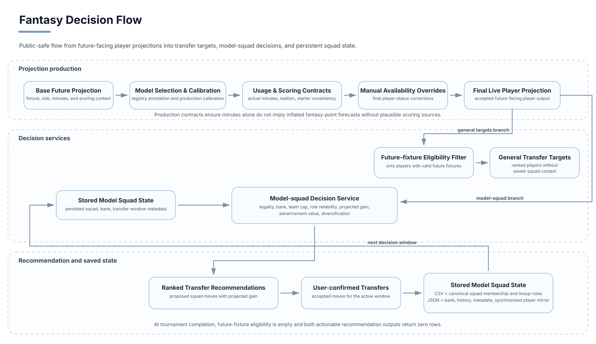

# Fantasy Decision System

## Product goal

The fantasy layer converted predictions into constrained squad and transfer decisions.

A high player projection was not automatically a valid recommendation.



The public-safe flow distinguishes general transfer targets from saved-squad decisions and shows how confirmed transfers update the persisted model squad for the next decision window.

## Decision constraints

The decision system accounted for:

- squad size;
- position requirements;
- formation;
- player price;
- available bank;
- remaining transfers;
- maximum players per team;
- team elimination;
- next-fixture availability;
- expected minutes and role;
- current squad membership;
- transfer-window rules.

## Main workflows

### Model squad

The system persisted a 15-player squad and tracked:

- formation;
- player roles;
- captain and vice-captain;
- budget and bank;
- transfer window;
- transfers remaining.

Canonical player state and generated mirrors were validated for consistency.

### Transfer targets

Transfer recommendations distinguished between:

- general player targets;
- squad-specific transfers;
- forced sales caused by elimination or no next fixture;
- upgrades constrained by bank, team limits, and position;
- role-aware priorities.

### Wildcard and multi-transfer planning

For special windows, the system supported broader squad reconstruction and multi-round decision logic.

The system still treated availability and lineup information as uncertain model inputs rather than guaranteed facts.

### Team of the Round

Team of the Round was an actuals-based product, not a prediction model.

It used finalized player fantasy points after the round.

### Golden Boot

The Golden Boot surface combined scoring state with remaining opportunity and tournament placement.

## Safety contracts

The recommendation layer applied post-model checks so that invalid candidates did not reach the product surface.

Examples:

- no positive future recommendation for an eliminated team;
- no recommendation without a future fixture;
- no transfer generation before snapshot validation;
- zero actionable recommendations in tournament-complete mode.

## Terminal behavior

After the tournament:

```text
future fixtures = 0
future player inference = not required
general transfer targets = 0
model-squad recommendations = 0
transfers remaining = 0
```

The final stored squad remained available as historical product state.

## Main lesson

Prediction and decision were separate engineering responsibilities. Domain constraints, persisted state, and lifecycle rules were necessary to turn model outputs into valid fantasy actions.
