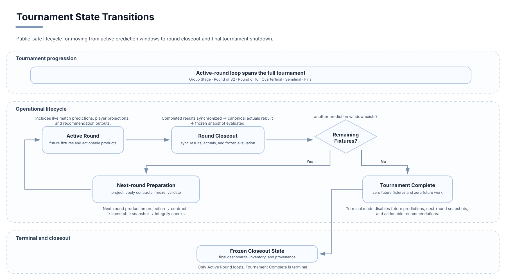

# Live Operations and Tournament Lifecycle

## Operating modes

The system supported three explicit lifecycle modes.

Only the active-round operating mode loops. Tournament-complete behavior is terminal and preserves accepted historical state without creating future work.

## Mode A — Tournament active

While future fixtures remained, the pipeline could:

- synchronize results and player data;
- refresh current and future predictions;
- generate transfer recommendations;
- update tournament products;
- validate APIs, frontend state, and operations health.

## Mode B — Round closeout

After a round completed, the system:

1. synchronized completed results;
2. rebuilt canonical actuals;
3. evaluated frozen pre-round match and player snapshots;
4. rebuilt cumulative dashboards;
5. generated the next round;
6. archived and validated the next-round player snapshot;
7. refreshed fantasy decisions only after validation.

This mode separated completed-round evaluation from next-round generation.

## Mode C — Tournament complete

After the final match, the system:

- synchronized final actuals;
- evaluated frozen final snapshots;
- preserved accepted predictions and product state;
- generated zero future predictions;
- generated zero actionable transfers;
- refreshed operations and final manifests;
- verified the final artifact inventory.

The terminal state was an accepted lifecycle outcome, not an error.

## Operations dashboard

The operations surface exposed information such as:

- tournament status;
- completed and future fixture counts;
- prediction availability;
- refresh freshness;
- recommendation counts;
- current transition identity;
- validation state.

## Failure modes controlled

### Leakage

A regenerated prediction after a result could look structurally valid but be invalid historical evidence.

Control: evaluate only immutable pre-match snapshots.

### Stale state

Different services could observe different squad, fixture, or player state.

Control: canonical ownership, ordered refresh stages, and mirror validation.

### Premature recommendation generation

A decision workflow could run before the new player snapshot was complete.

Control: validate snapshot coverage and model identity before recommendations.

### Terminal misinterpretation

Zero future rows could be mistaken for pipeline failure.

Control: explicit tournament-complete semantics in services, APIs, and UI.

### Artifact drift

Accepted historical outputs could be silently modified.

Control: timestamped paths, manifests, inventory records, and checksums.

## Closeout

The final closeout preserved:

- 104 completed fixtures;
- zero future fixtures;
- zero future predictions;
- zero actionable transfers;
- the final squad;
- final evaluation dashboards;
- accepted historical snapshots;
- a checksum-backed artifact inventory.
