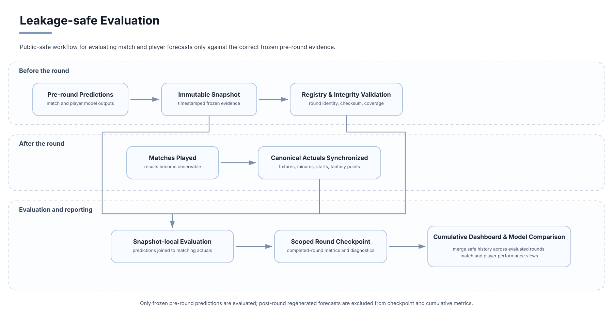
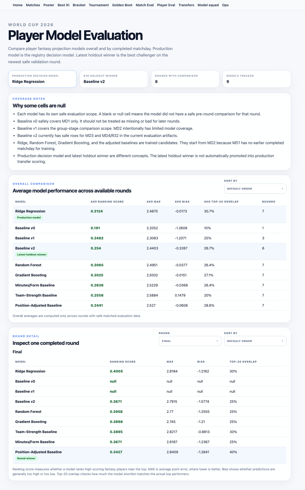

# Player-Prediction Evaluation

## Evaluation question

Did the production player models add value beyond predicting appearance alone, especially for ranking and fantasy selection?

## Benchmark hierarchy

1. **Naive appearance baseline**  
   Expected appearance or minutes value only.

2. **Rules-based fantasy baseline**  
   Stable fantasy-scoring contract.

3. **Ridge decision model**  
   Production model selected for fantasy ranking and player selection.

## Leakage-safe scope

The primary rules-versus-Ridge comparison covered six rounds:

- Group Stage MD3;
- Round of 32;
- Round of 16;
- quarter-finals;
- semi-finals;
- third-place match and final.

Each model covered 1,775 player-round observations.

The three-model appearance comparison covered the final four knockout groupings and 508 common player-round observations per model.

Registered immutable pre-round snapshots were joined only to canonical actuals from the matching completed round before metrics and ranking diagnostics were produced.

## Evaluation dashboard

The detailed view separates the production decision model, the latest holdout winner, and the winner for one completed round. Null cells remain visible when a model did not have a safe pre-round comparison for that scope.

## Primary six-round results

| Model | Coverage | MAE | RMSE | Within 1 | Within 2 | Bias | Spearman |
|---|---:|---:|---:|---:|---:|---:|---:|
| Rules baseline | 1,775 | 2.463 | 3.429 | 36.2% | 53.7% | -0.182 | 0.207 |
| Ridge model | 1,775 | 2.447 | 3.280 | 28.0% | 55.2% | +0.142 | 0.281 |

Ridge made a small MAE improvement and a clearer RMSE and ranking improvement.

The rules baseline remained substantially better within one fantasy point.

## Common four-round benchmark

| Model | Coverage | MAE | RMSE | Bias | Spearman |
|---|---:|---:|---:|---:|---:|
| Naive appearance baseline | 508 | 2.246 | 3.741 | -1.719 | 0.139 |
| Rules baseline | 508 | 2.554 | 3.545 | +0.021 | 0.225 |
| Ridge model | 508 | 2.656 | 3.546 | +0.385 | 0.225 |

The naive baseline achieved the lowest MAE by making conservative low predictions. It also had:

- the worst RMSE;
- a large negative bias;
- weaker rank correlation.

This illustrates why exact-point MAE alone is not enough for fantasy decision evaluation.

## Ranking and selection

Across the six common rules-versus-Ridge rounds:

| Model | Mean round Spearman | Top-20 recall | Top-20 average actual points | Gain vs full pool |
|---|---:|---:|---:|---:|
| Rules baseline | 0.252 | 25.0% | 4.16 | +1.14 |
| Ridge model | 0.299 | 29.2% | 4.78 | +1.76 |

This ranking evidence was the strongest reason to retain Ridge as the fantasy-decision model.

## Realism audit

The final snapshot contracts checked for known failure modes such as:

- high forecasts paired with low projected minutes;
- high forecasts for players not treated as expected starters;
- positive forecasts for eliminated or no-next-fixture players;
- high forecasts unsupported by prior attacking contribution.

No admitted immutable post-contract row triggered those predefined checks.

This result does not mean every forecast was perfectly calibrated. It means the targeted failure patterns were absent from the evaluated final contract.

## Feature categories

The public-safe feature categories included:

- archived base prediction;
- projected minutes;
- appearance value;
- attacking value;
- clean-sheet value;
- result value;
- price;
- position;
- pre-round official points;
- pre-round form.

Standardized fitted coefficients were not preserved clearly enough for a public coefficient-magnitude ranking.

## Main conclusion

The Ridge model was more useful as a fantasy-decision and ranking model than as an exact-point model. Exact player-point prediction remained noisy.
